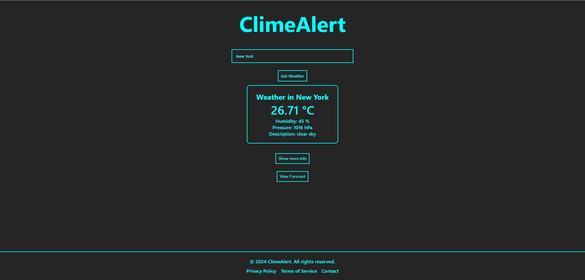

<h1 align="center">
  ClimeAlert ⛅ 
  <a href="https://clime-alert.netlify.app/" target="_blank">ClimeAlert</a>
</h1>

## ClimeAlert

Minimalized, easy to use, accourite Weather App which was created using the React  \
on this web site you can enter the location and it will show you current weather of that city.

## Preview

## Set Up 

### `npm start`

Runs the app in the development mode.\
Open [http://localhost:3000](http://localhost:3000) to view it in your browser.

The page will reload when you make changes.\
You may also see any lint errors in the console.

### `npm run build`

Builds the app for production to the `build` folder.\
It correctly bundles React in production mode and optimizes the build for the best performance.

The build is minified and the filenames include the hashes.\
Your app is ready to be deployed!

See the section about [deployment](https://facebook.github.io/create-react-app/docs/deployment) for more information.

## 🧰 Tools

* 🎯 React
* 💻 HTML5
* 🖌️ CSS (Styling)
* 📹 Framer Motion (Animations)
* 🛰️ Netlify (Deployment)
* 🗄️ JSON (Data)
* 📝 YUP (Form Validations)
* 🧭 React Router (Navigation)

# 🎨 Colors 

| Color               | Hex                                                                 |
| --------------      | ------------------------------------------------------------------- | 
| Aqua                |  `#00FFFF`  |
| Dark shade Of Gray  |  `#262525`  |
| Dark Gray           |  `#0D0D13`  |

